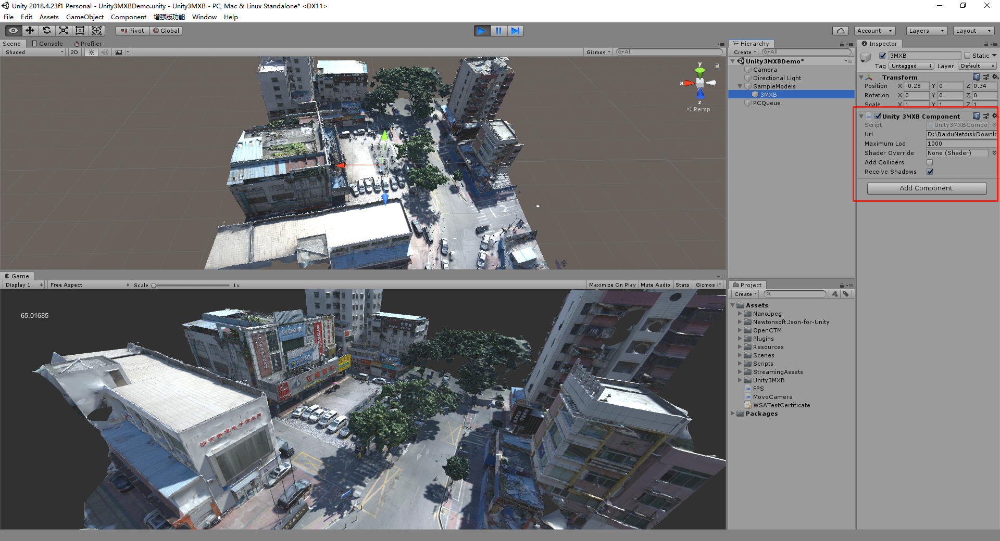
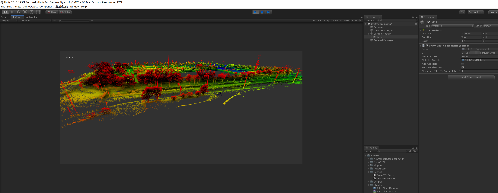

# Unity-3mx

Load [3MX/3MXB](https://docs.bentley.com/LiveContent/web/ContextCapture%20Help-v9/en/GUID-CED0ABE6-2EE3-458D-9810-D87EC3C521BD.html) LOD model files generated by Bentley ContextCapture into Unity.
> use PointCloudMaterial as Material Override for pointcloud.

### Tested platform
- PC(Win) Standalone
- WebGL
- Android

### Tested dev env:
- Windows 10
- Unity2018.4.23f1

### Thirdparty (source codes included for convenience):
- [OpenCTM](https://github.com/BarryWangYang/OpenCTM-Optimizing-GC-)
- [NanoJpeg](https://github.com/Deathspike/NanoJPEG.NET)
- [Newtonsoft.Json-for-Unity](https://github.com/jilleJr/Newtonsoft.Json-for-Unity)

### Known issues
- Cache strategy is NOT optimized.
